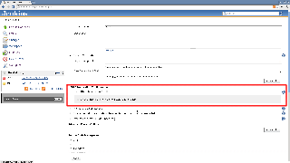
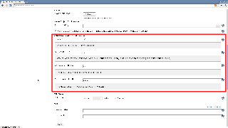

## HTML5 Notifier Plugin

Provides W3C Web Notifications support for builds.

## Browser compatibility

This plugin is compatible with Google Chrome, Safari, and Firefox

Other browsers do not support HTML5 notifications right now. You can check this website for details : http://caniuse.com/#feat=notifications

## Screenshots

| Section       | Screenshot    |
| ------------- |:-------------:|
| Safari Notification |  |
| System Configuration |  |
| Job Configuration |  |

## Changelog

### 1.5 (released 2015-03-06)

    [JENKINS-27222](https://issues.jenkins-ci.org/browse/JENKINS-27222) - Fixes global configuration not saving/loading.

### 1.3 (released 2014-08-01)

    [JENKINS-16236](https://issues.jenkins-ci.org/browse/JENKINS-13138) - upgrade to use current html5 notification spec. Removes html in the notifications but now works again.

### 1.2 (released 2012-04-06)

    updated minimum required core to v1.455 to pick up prototype.js:1.7
    [JENKINS-13138](https://issues.jenkins-ci.org/browse/JENKINS-13138) - Verify action doesn't work with CSRF option
    [JENKINS-13322](https://issues.jenkins-ci.org/browse/JENKINS-13322) - Configure tab freezes when using both the HTML5 notifier plugin and the Android Emulator Plugin
    [JENKINS-12538](https://issues.jenkins-ci.org/browse/JENKINS-12538) - java.lang.String cannot be cast to net.sf.json.JSONArray
    [JENKINS-13038](https://issues.jenkins-ci.org/browse/JENKINS-13038) - HTML5 notifier plugin breaks Jenkins with CSRF protection

### 1.1 (released 2012-02-02)

    [JENKINS-11618](https://issues.jenkins-ci.org/browse/JENKINS-11618) - prototype.js
    added per-job job property to skip notifications
    added ability to only notify on different build result than previous
    cleaned up the notification area html

### 1.0 (released 2011-10-19)

    initial implementation
    fully I18N compliant
